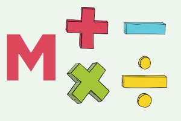

# Simple Maths



Perform mathematical operations with Micro:bit, including calculating the square of a number or counting up to a specified number.


## Available Blocks

### 1. Multiplication
- **Block:** `multiply $a by $b`
- **Description:** Multiplies two numbers, `a` and `b`.
- **Usage:** This block takes two numeric values and returns their product.
- **Example:**

  ```typescript
  let result = SimpleMaths.multiply(4, 5);
  ```

### 2. Division
- **Block:** divide $a by $b
- **Description:** Divides the number `a` by the number b.
- **Usage:** This block divides the value `a` by b. If `b` is 0, it returns 0 to avoid an error.
- **Example:**

```typescript
let result = SimpleMaths.divide(10, 2);
```

3. Addition
- **Block:** add $a to $b
- **Description:** Adds the number `a` to the number b.
- **Usage:** This block adds two numbers together and returns the result.
- **Example:**

```typescript
let result = SimpleMaths.add(7, 3);
```

4. Subtraction
- **Block:** subtract $b from $a
- **Description:** Subtracts the number `b` from the number a.
- **Usage:** This block subtracts `b` from `a` and returns the result.
- **Example:**

```typescript
let result = SimpleMaths.subtract(10, 4);
```

5. Square
- **Block:** square of $a
- **Description:** Calculates the square of `a` number a.
- **Usage:** This block takes `a` number and returns its square.
- **Example:**

```typescript
let result = SimpleMaths.square(5);
```

6. Remainder of `a` Division
- **Block:** remainder of $a divided by $b
- **Description:** Calculates the remainder of dividing `a` by b.
- **Usage:** This block returns the remainder of the division of `a` by b.
- **Example:**

```typescript
let result = SimpleMaths.remainder(10, 3);
```

7. Count to `a` Number
- **Block:** count from 1 to `n`
- **Description:** Counts from 1 to the specified number `n`.
- **Usage:** This block counts from 1 to `n`, displaying each number on the micro
screen.
- **Example:**

```typescript
SimpleMaths.countTo(10);
```

## Installation
To add this extension to your project in MakeCode, follow these steps:

1. Open MakeCode in your browser.
2. Click on "Extensions" in the menu.
3. Enter the URL of this repository: https://github.com/your-username/simple-math.